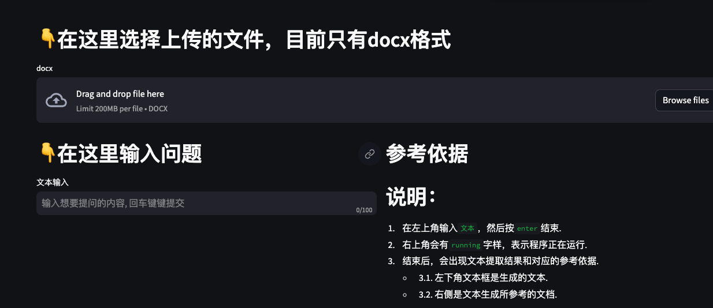
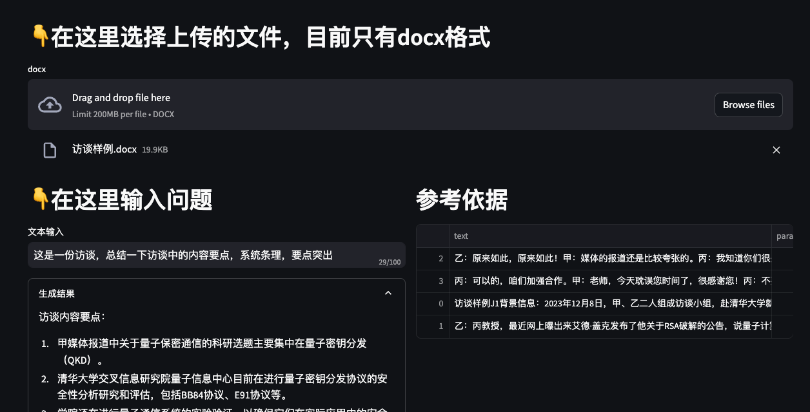

## 文档搜索问答
可以本地化部署，外挂文档，搜索增强（RAG）的一个简单demo。支持上传文件并提问，也支持文件夹搜索问答。
这是第二版，基于LLaMa-index包开发。该包封装了各种文件处理，以及各种数据库的支持——甚至包括图数据库和图谱

首先要下载准备好模型到本地，准备好python环境，然后run.sh就可以
注意路径配置，包括自己的本地数据目录

## 用法

### 命令行形式
1. `rag_faiss_llama_index.py`文件里面

### web端
```bash
bash run.sh
```



整体思路，先在主类中，初始化emb模型和LLM模型
在文件QA的时候，传入文件，处理文件
在文件夹QA的时候，

TODO
1. 面向私域的用户管理，基于数据库的
2. API鉴权